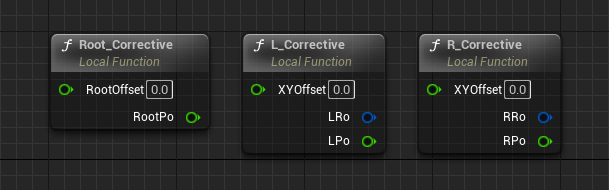
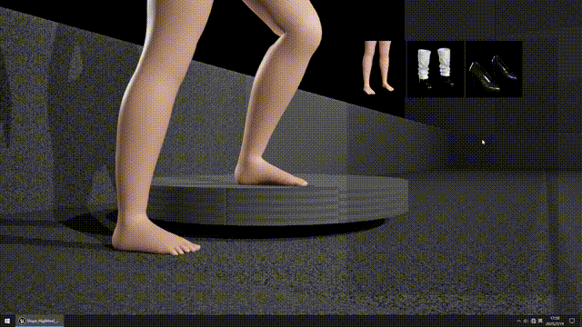

1.  1 **Feature Introduction**

&nbsp;

**Slope HighHeel IK‌** is a functional extension for **Control Rig**‌, Using a ‌compensation algorithm‌, it achieves ‌sole-ground contact‌ for high heels ‌with **0°- 33°** heel slopes‌ when walking on ‌**0°- 25°** inclined surfaces‌, This asset is ‌available on **Fab‌**. (Link will be added after approval)

&nbsp;

* * *

&nbsp;

The project includes three built-in states to showcase its capabilities:

- Barefoot
- Flat Shoes
- High Heels

&nbsp;

‌You can add custom shoe shapes through the workflow described in the documentation.

&nbsp;

&nbsp;

* * *

&nbsp;

**Current limitations**: Applicable only on flat surfaces and planar slope surfaces (including stairs), with minor discrepancies occurring at varying angles.

&nbsp;