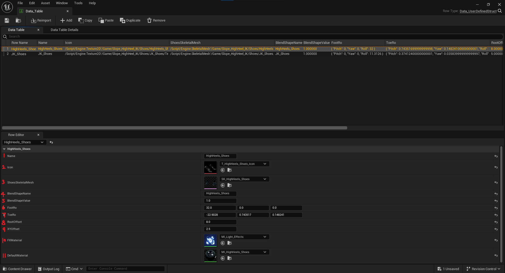
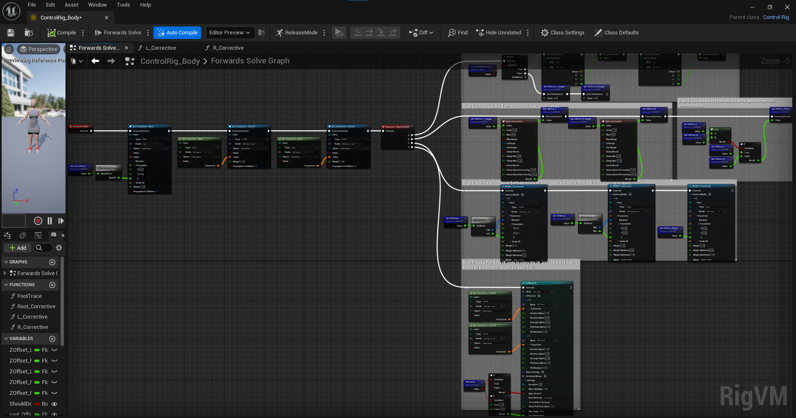
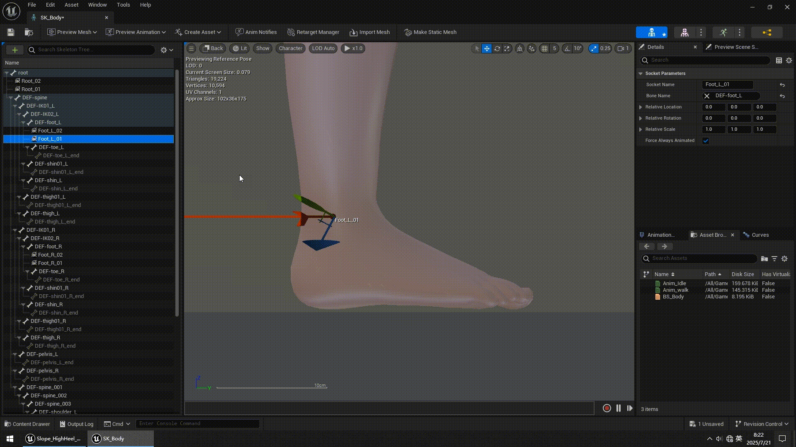

1.  2 ‌**Dependencies**

&nbsp;

The compensation algorithm requires these prerequisites to be integrated into your project.

&nbsp;

‌Footwear Configuration Parameters:

1.  ‌**Name**‌: Shoe name
2.  ‌**Icon**‌: Shoe icon
3.  ‌**SkeletalMesh**‌: Rigged shoe model (with skeleton)
4.  ‌**BlendShapeName**‌: Foot morph target for shoe adaptation
5.  ‌**BlendShapeValue**‌: Morph activation switch (1=On, 0=Off)
6.  ‌**FootRotation**‌: Foot bone rotation when worn
7.  ‌**ToeRotation**‌: Toe bone rotation when worn
8.  ‌**RootOffset**‌: Vertical offset from ground
9.  ‌**XYOffset**‌: Slope compensation (longitudinal/lateral)
10. ‌**FXMaterial**‌: (Optional) Shoe-change VFX material
11. ‌**DefaultMaterial**‌: Base shoe material

&nbsp;

* * *

&nbsp;

&nbsp;

&nbsp;

* * *

&nbsp;

&nbsp;

&nbsp;

‌Create two slots on each bone (**Root**, **Foot_L**, **Foot_R**) spaced 0.5 units apart along the Y-axis for raycasting.

&nbsp;

&nbsp;