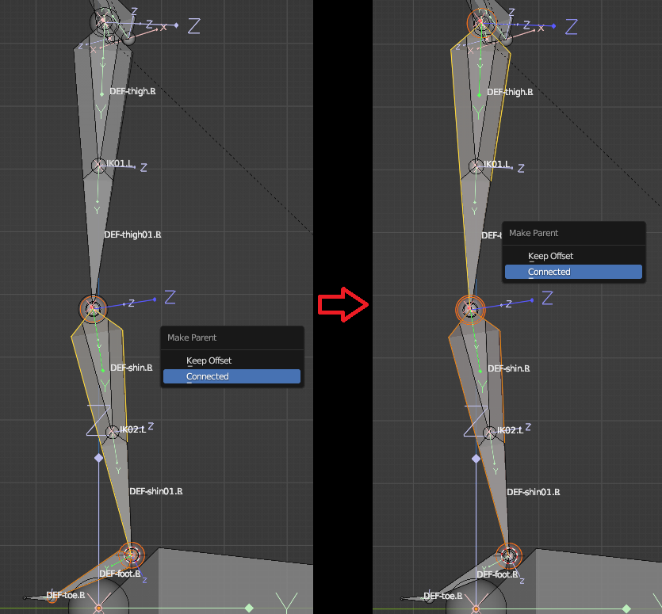
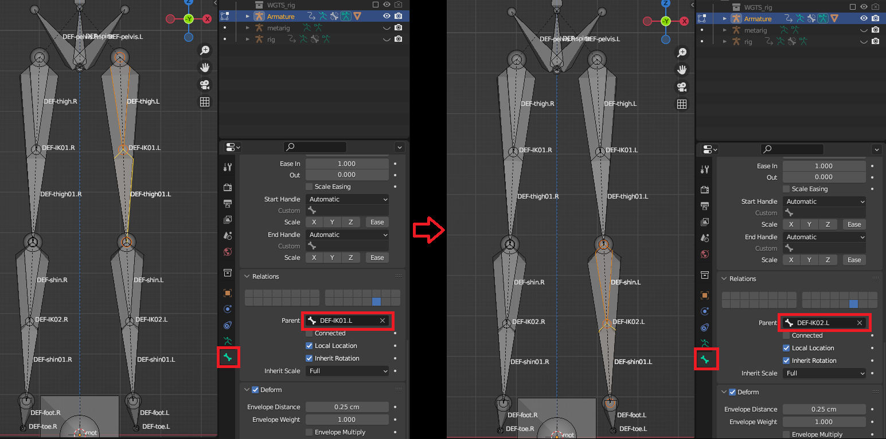
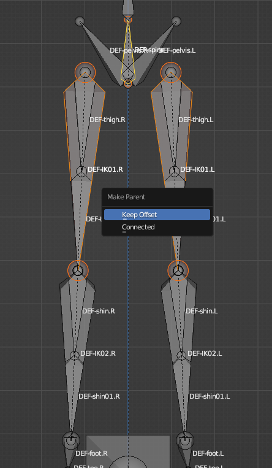

2.2 **Create the skeleton for importing into UE** (Ref: 2.blend)

&nbsp;

Disable axes visibility, switch the ‌bone layer‌ to the ‌deform bones layer‌, and display ‌bone names‌.

‌Layer Settings:‌

‌Root Bone Layer‌

‌Deform Bones Layer‌

‌If adding a Root bone for UE import‌: Enable ‌both Layer 1 and Layer 2‌.

‌If NOT adding a Root bone‌: Enable ‌only Layer 2‌.

&nbsp;

&nbsp;

Switch to ‌Edit Mode‌, press `A` to ‌select all bones‌, press `Shift+D` to ‌duplicate‌, then press `G` followed by `X+120` to ‌move them to the right side‌.

&nbsp;

&nbsp;

Press `P` to ‌Separate Bones‌, switch to ‌Object Mode‌, then:

- ‌**If adding a Root bone**‌: Rename the object to **Armature‌**
- ‌**If NOT adding a Root bone**‌: Rename it to ‌**Root‌**

&nbsp;

&nbsp;

Switch to ‌Edit Mode‌ and rename all bones to match the ‌left-side bone names‌.

&nbsp;

&nbsp;

Press `A` to ‌select all bones‌, then press `G` followed by `X -120` to ‌reset them to their default positions‌.

&nbsp;

&nbsp;

‌Switch to Object Mode, then press `Shift+H` to isolate the display of the Armature bones.

&nbsp;

* * *

&nbsp;

&nbsp;

Switch to Edit Mode, press **`Shift+D`** to duplicate these two bones, and rename them to **IK01.L** and **IK02.L**

&nbsp;

&nbsp;

‌Select the head of the thigh bone, then press **`Shift+S`** to move the 3D Cursor to the selected item.

&nbsp;

&nbsp;

‌Select the head of the IK01.L bone, then press `Shift+S` to move the selected item to the 3D Cursor.

&nbsp;

&nbsp;

‌Perform the same operation to move the selected bone to the position visually depicted in the diagram below.

&nbsp;

&nbsp;

‌Select the **Foot.L** and **IK02.L** bones, press `Ctrl+P` to parent them, then connect **IK02.L** to **IK01.L**.

&nbsp;

&nbsp;

‌Select **Foot.L**  **IK02.L**  and **IK01.L**  then right-click and choose Symmetrize.‌

&nbsp;

&nbsp;

Parent **thigh.L** and **thigh01.L** to **IK01.L** .

Parent **shin.L** and **shin01.L** to **IK02.L** , then apply identical parenting to the right-side bones.

&nbsp;

&nbsp;

‌Select **IK01.R**, **IK01.L**, and **spine** in order, then press `Ctrl+P` and choose Keep Offset.

&nbsp;

&nbsp;

Switch to Pose Mode, add a Bone Constraint - Copy Transforms to each bone, target the **Rig**, select bones with matching names (excluding IK bones), and apply this operation to all relevant bones.‌

&nbsp;

&nbsp;

Add a copy transform to **IK01.L** and **IK02.L**, then perform the same operation on the right side.

&nbsp;

* * *

&nbsp;

&nbsp;

‌Return to Object Mode, press `Alt+H` to unhide all objects, select both the character mesh and the **Armature** object, then press `Ctrl+P` and choose Automatic Weights.

&nbsp;

&nbsp;

Select the **Rig** armature, restore the controller layers, then enter Pose Mode to test your rigging setup.

&nbsp;