2.3 ‌**Bake Animation** (Ref: 3.blend)

&nbsp;

Select the **Rig** armature, choose the "walk" animation, set the frame rate to 30 FPS, and set the end frame to 32.

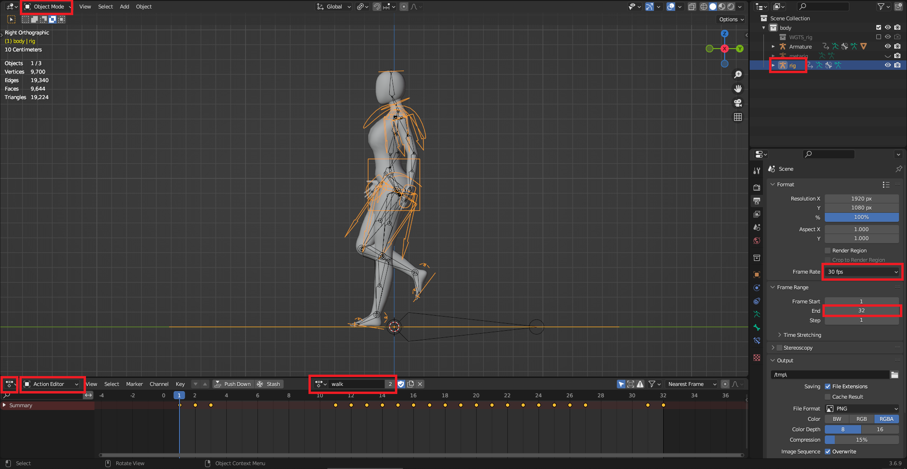

&nbsp;

&nbsp;

‌Select the iTaSC IK solver with precision 0.0001 and iterations set to 1000

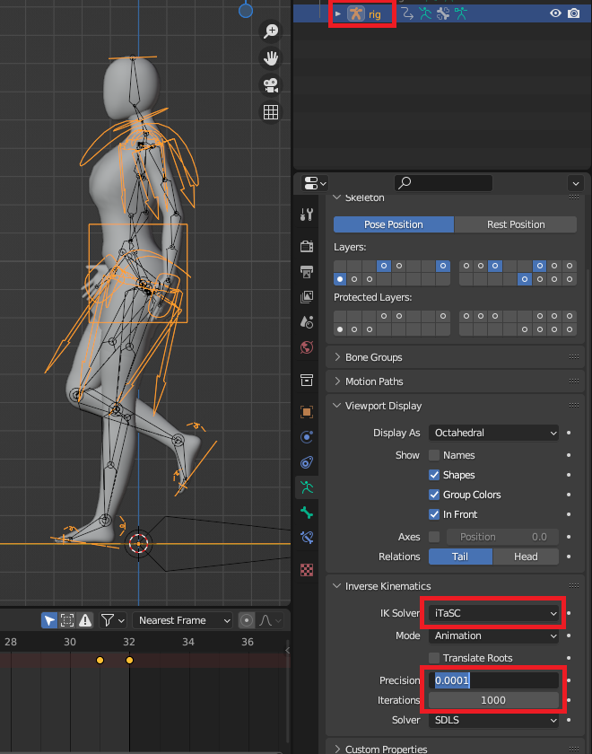

&nbsp;

&nbsp;

‌Select the **Rig** with iTaSC and keep the Armature settings at default.

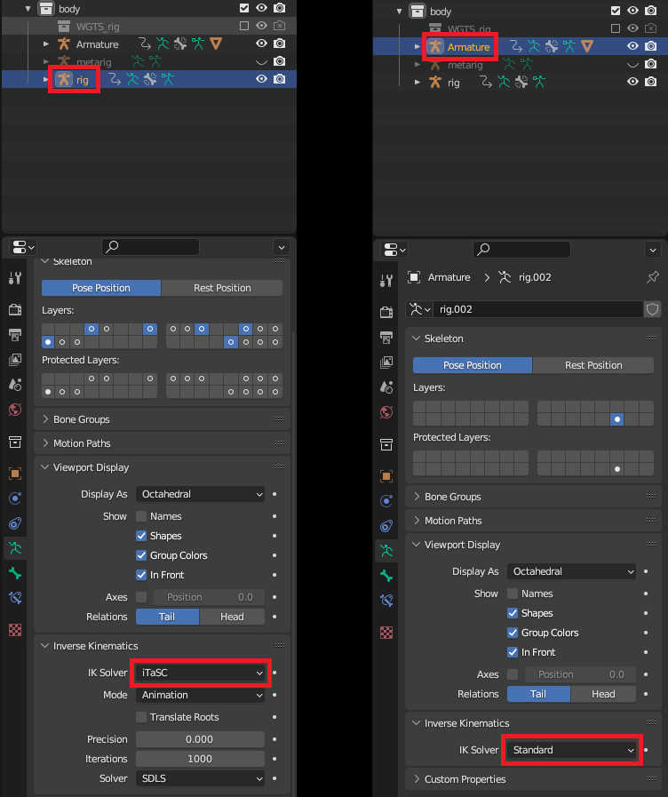

&nbsp;

&nbsp;

‌Select the **Armature**, enter Pose Mode, and press `A` to select all bones.

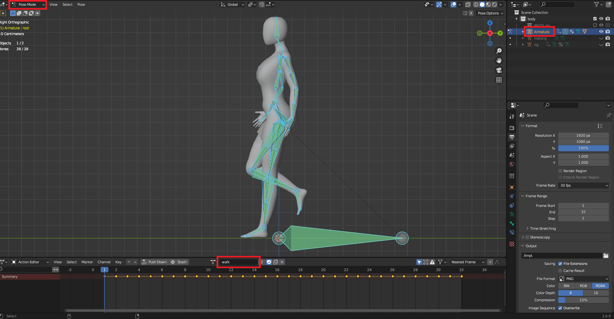

&nbsp;

&nbsp;

Bake Animation.

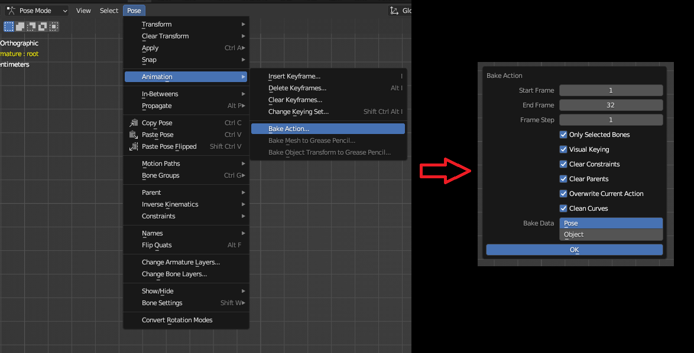

&nbsp;

&nbsp;

‌Export Skeletal Animation.

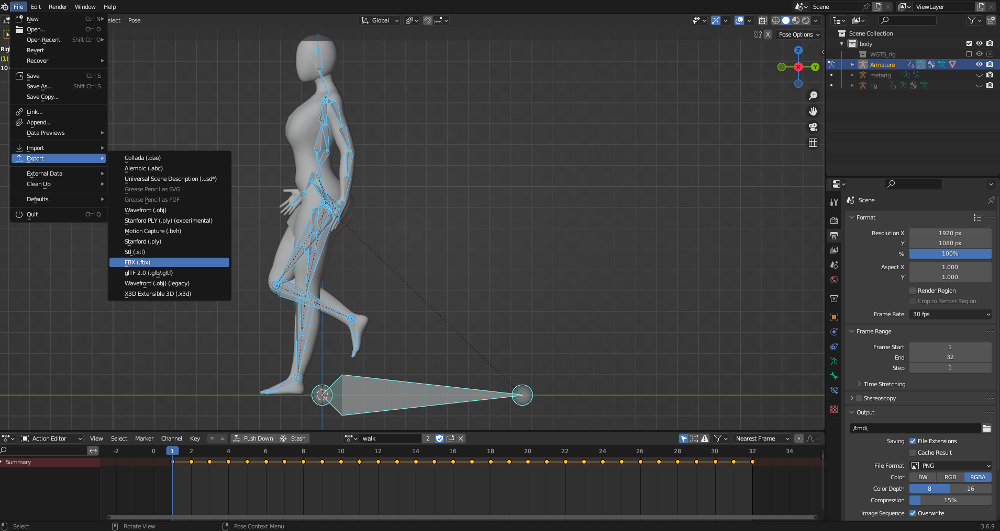

&nbsp;

&nbsp;

‌Export to your own folder.

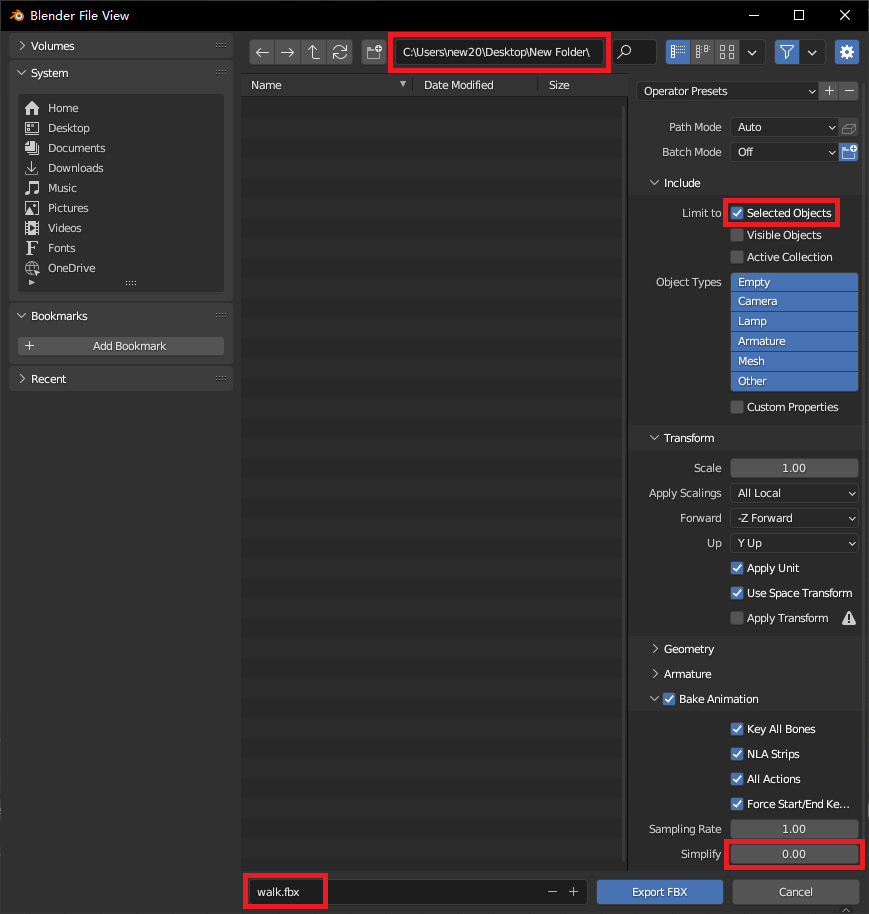

&nbsp;

* * *

&nbsp;

&nbsp;

‌Reopen 4.blend, bake the idle animation, and repeat the same process.

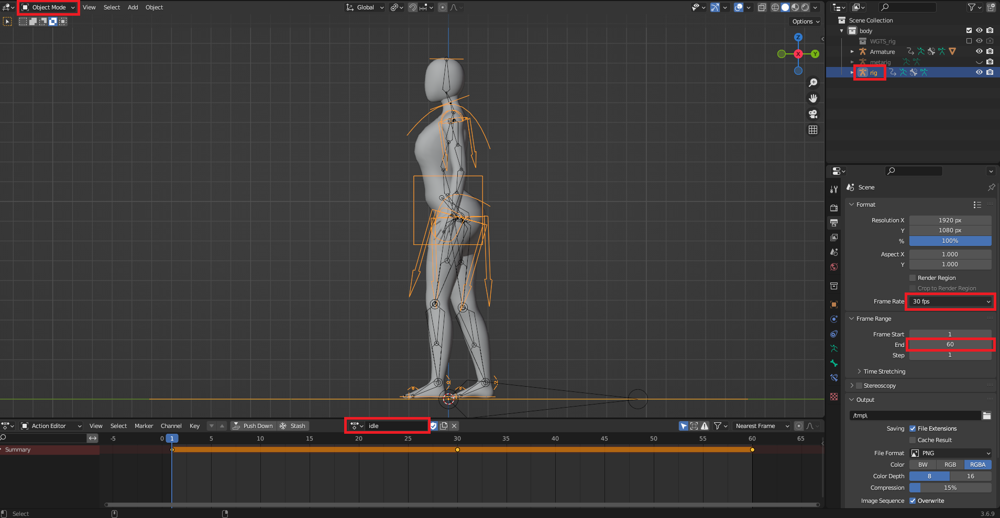

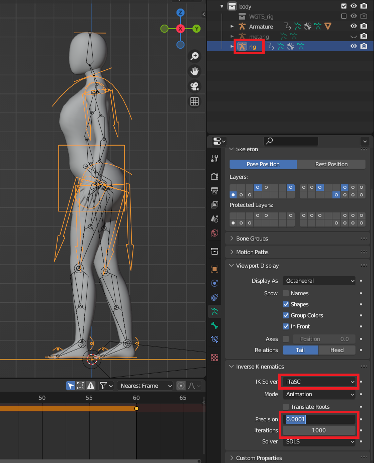

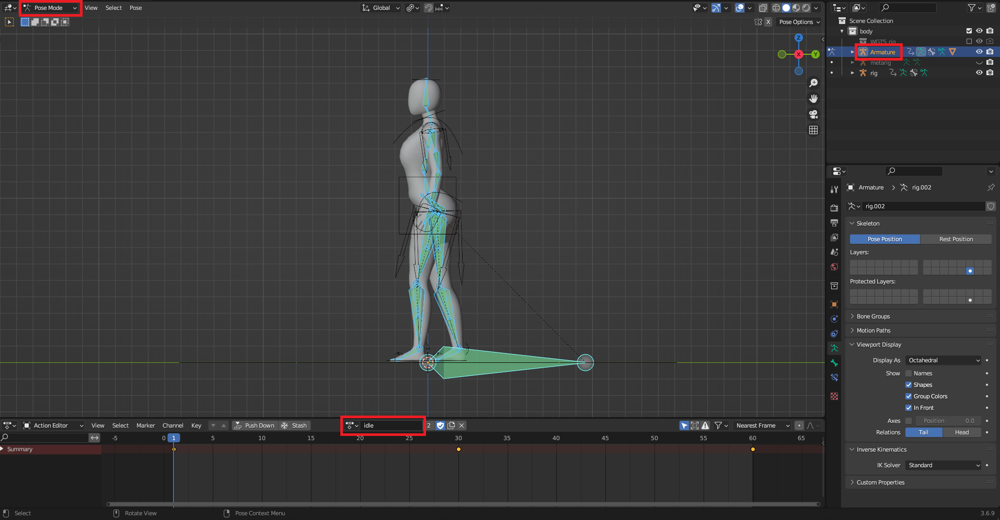

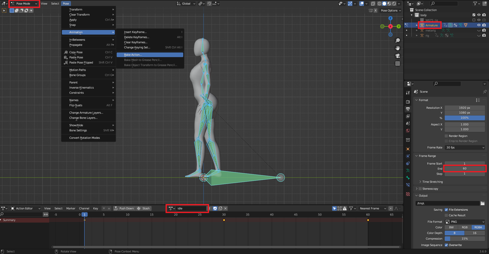

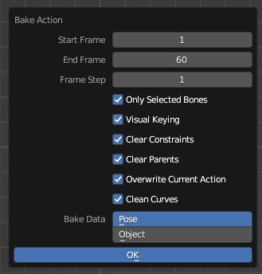

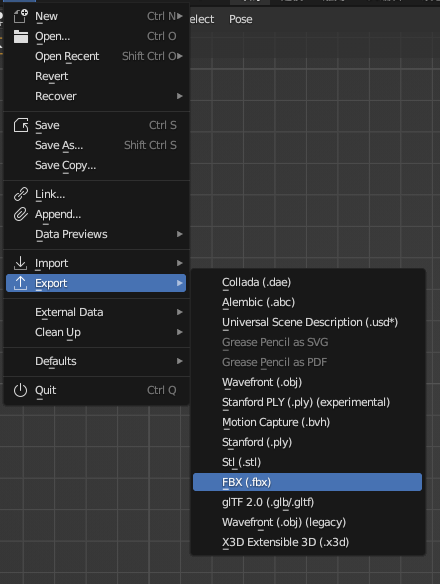

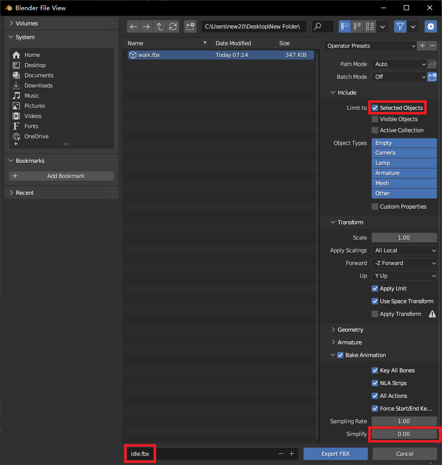

&nbsp;