2.7 **‌Import the asset** (The **Practice** folder is only for workflow exercises. When performing Chapter 3 operations, use the contents from the **Slope_HighHeel_IK** folder.)

&nbsp;

‌Create a new folder named "**Practice**".

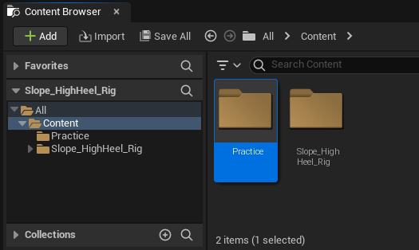

&nbsp;

Drag and drop the file into the **Unreal Engine** folder.

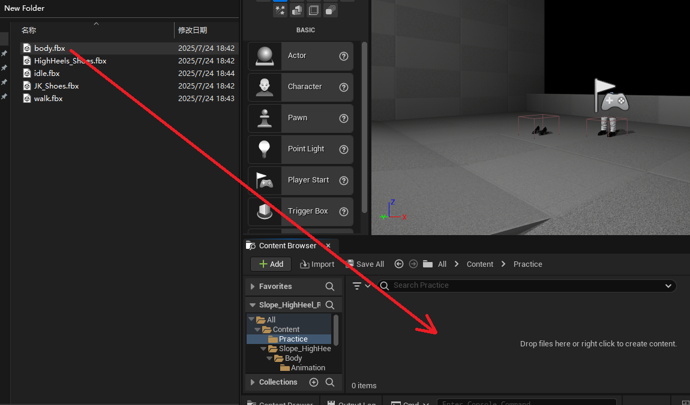

&nbsp;

&nbsp;

Configure settings.

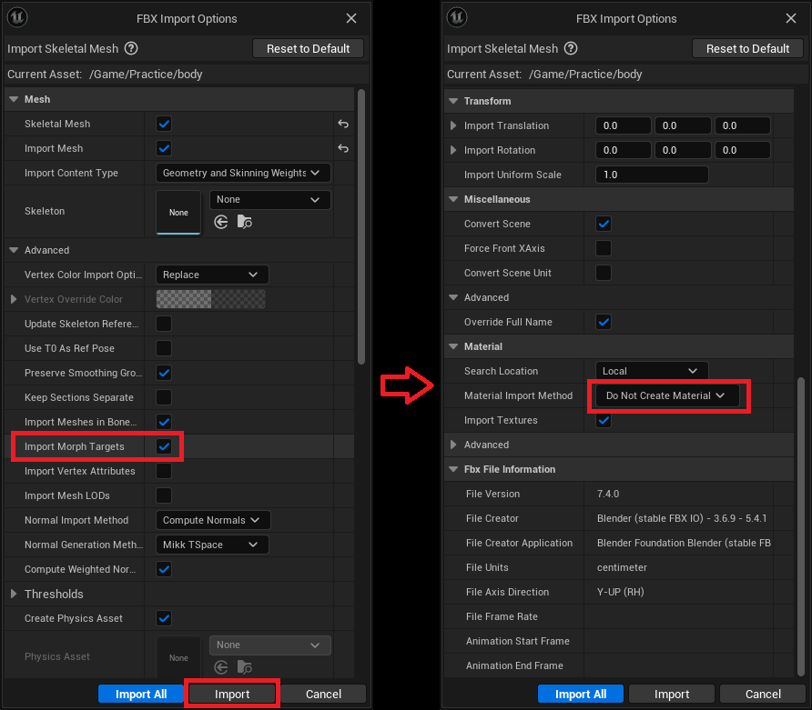

&nbsp;

&nbsp;

Open the **body** model and check if the shape keys/morph targets are working.

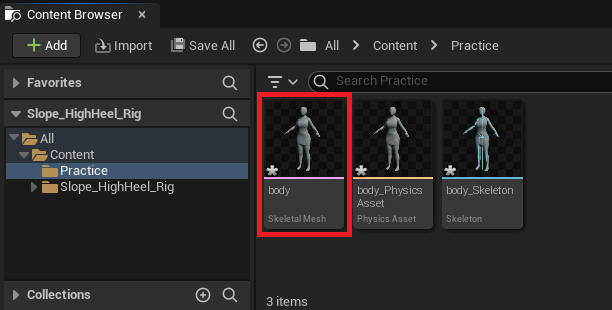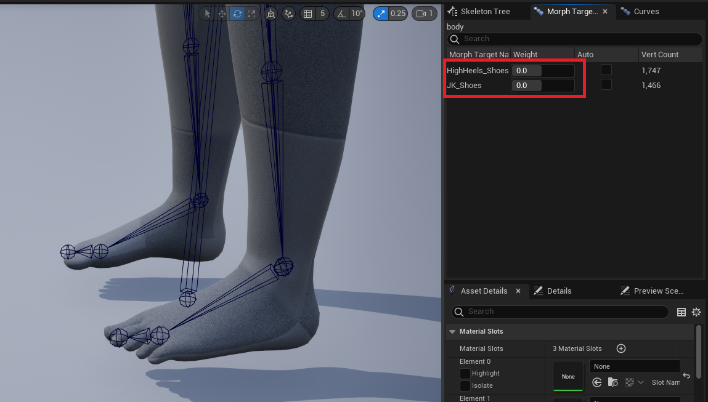

&nbsp;

* * *

&nbsp;

&nbsp;

Open **body_Skeleton** and add a **socket**.

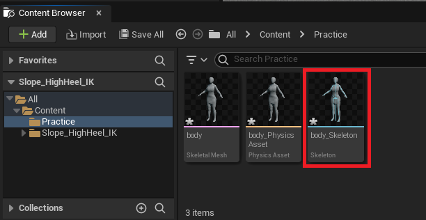

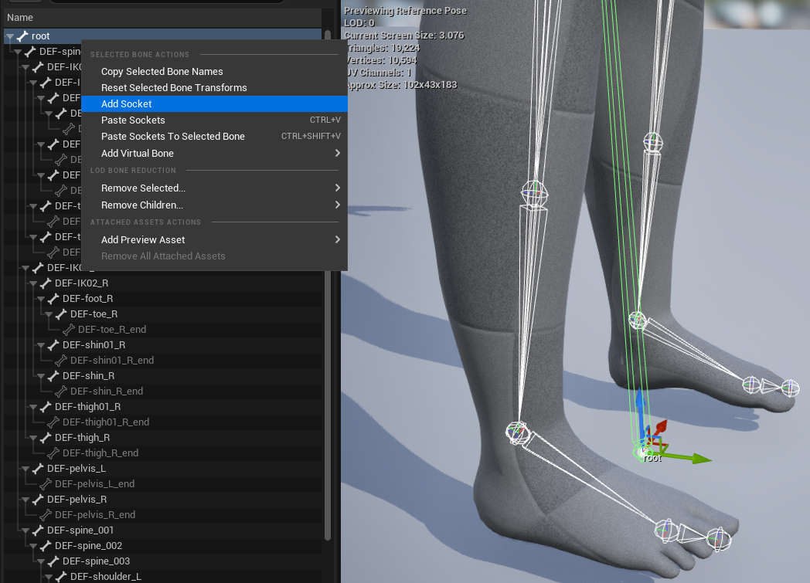

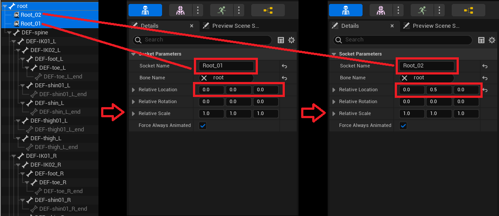

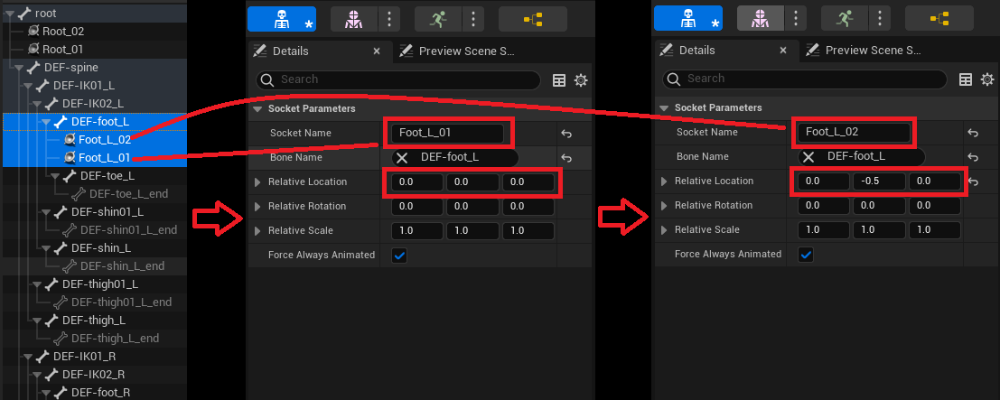

&nbsp;

* * *

&nbsp;

&nbsp;

Import animation files.

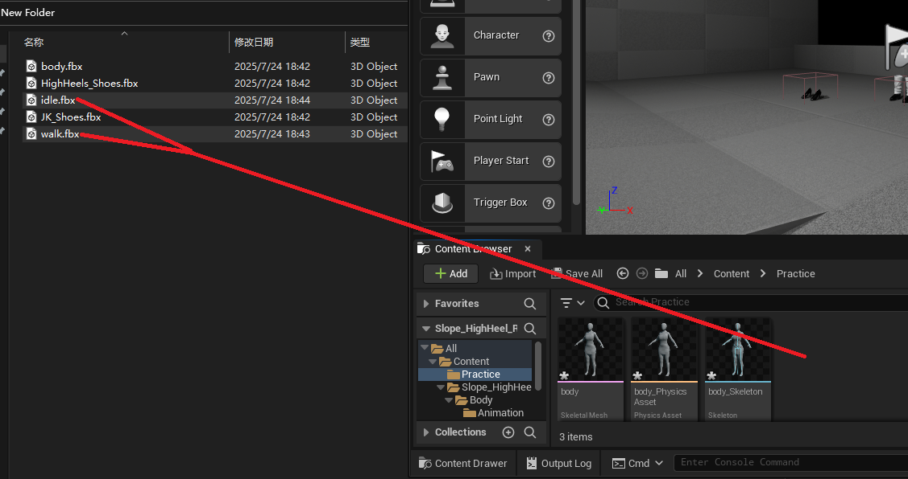

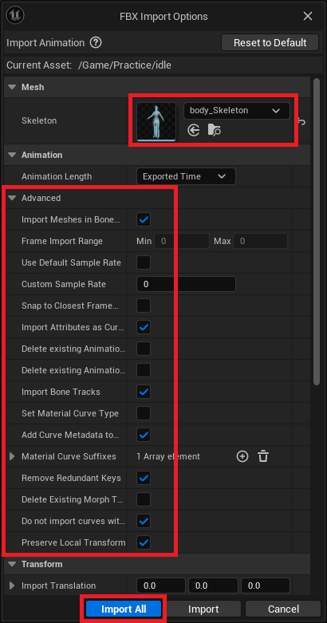

&nbsp;

&nbsp;

Open and play the animation to check if root motion is working.

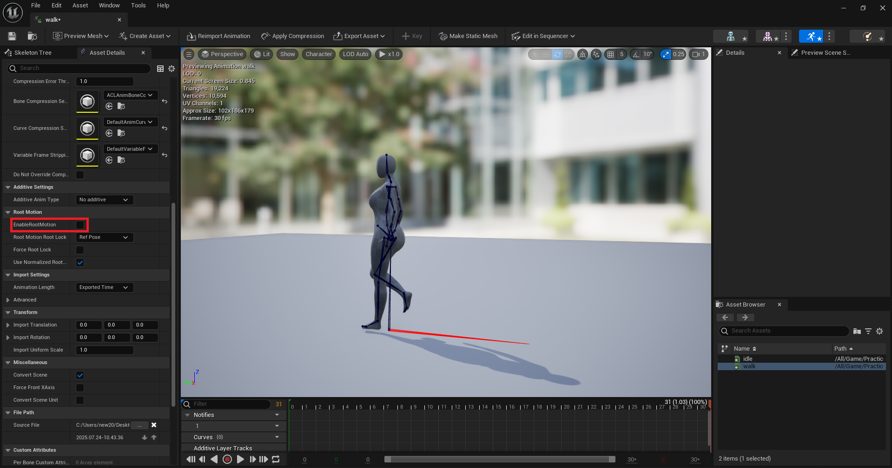

&nbsp;

* * *

&nbsp;

&nbsp;

Import the shoe skeletal mesh.

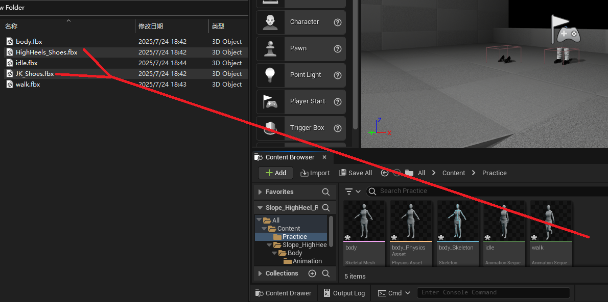

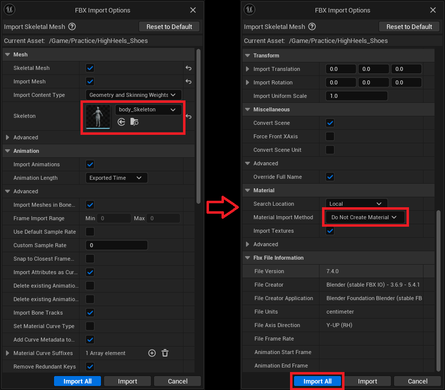

&nbsp;

&nbsp;

Open the shoe asset and verify if the skeleton was successfully imported.

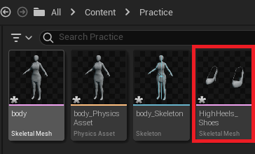

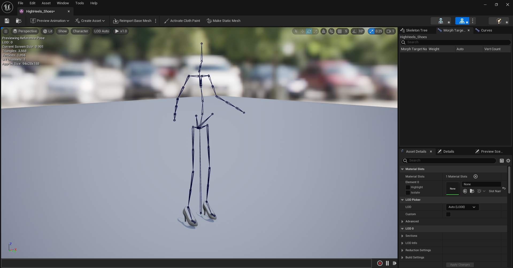

&nbsp;