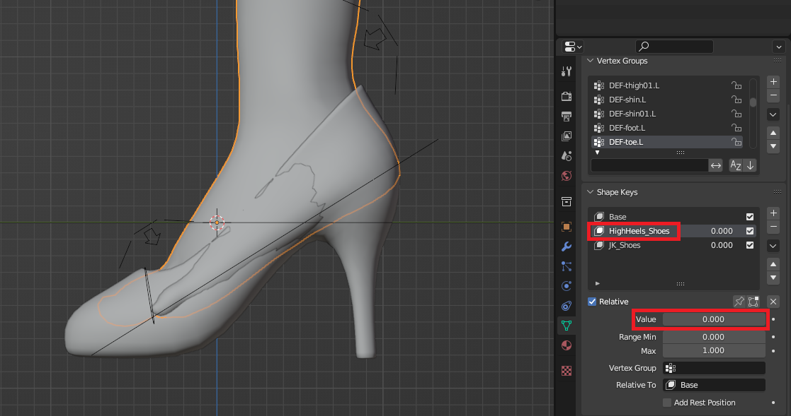
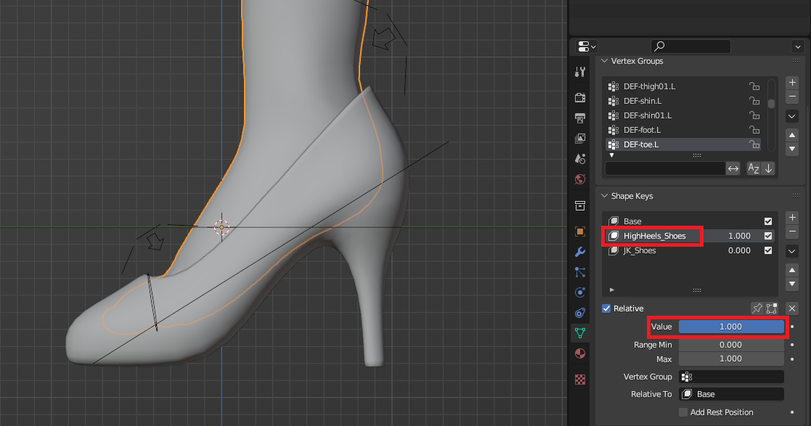
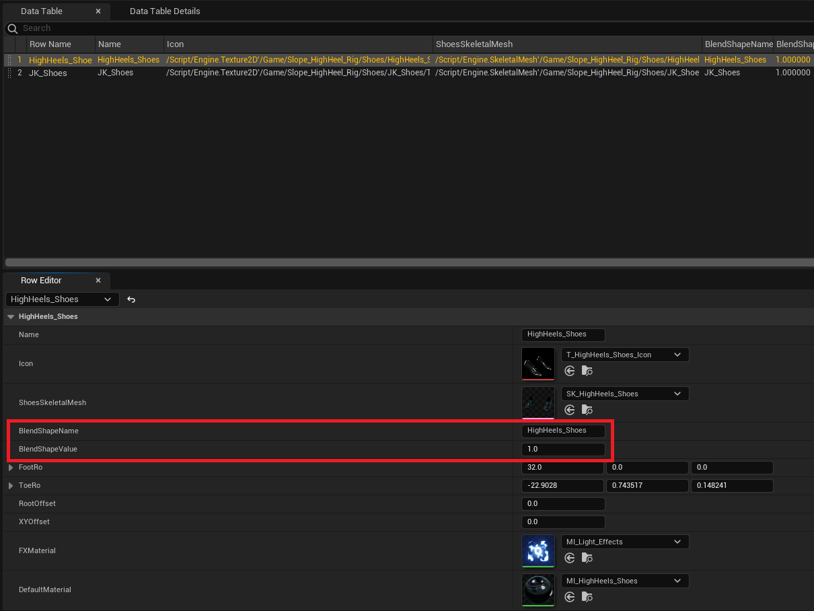
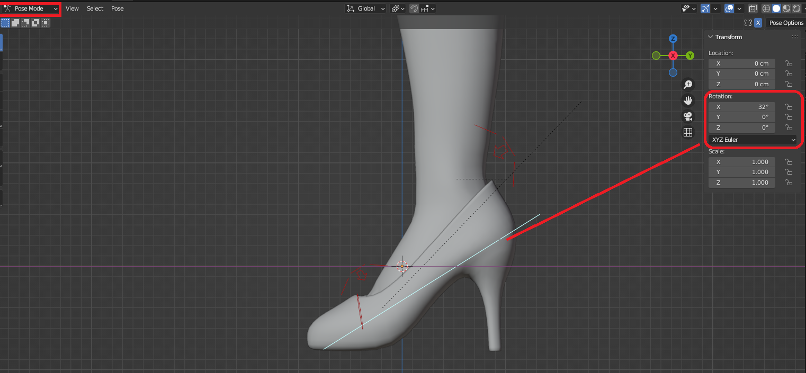
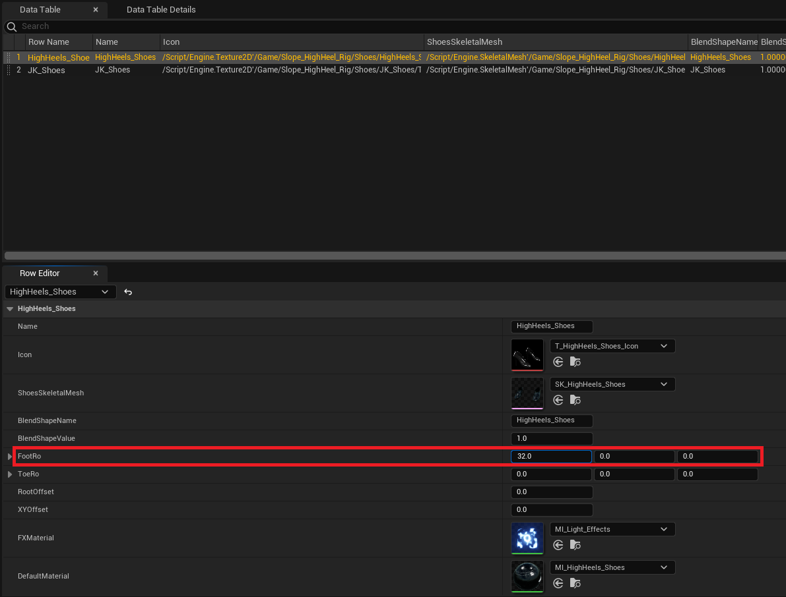
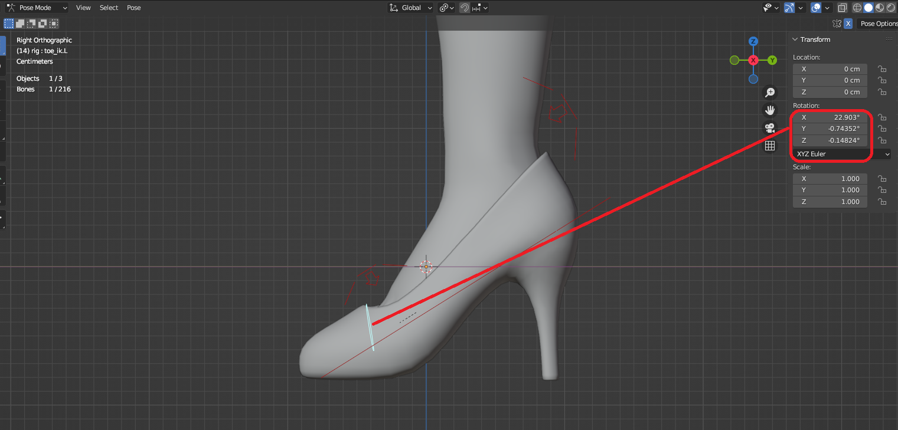

3.1 **Data Table**

&nbsp;

**Shape Keys**：（Ref: 4.blend）

&nbsp;

* * *

&nbsp;

&nbsp;

**FootRo** Value：（Ref: 4.blend）

&nbsp;

* * *

&nbsp;

&nbsp;

**ToeRo** Value：（Ref: 4.blend）

For the Toe bone, reverse the axis orientation values when inputting in Unreal Engine.

&nbsp;

&nbsp;

When copying values directly, there may be minor decimal point errors. Remember to flip positive values to negative, and negative values to positive.

&nbsp;

* * *

&nbsp;

&nbsp;

**RootOffset** Value：

Switch to the shoe you intend to debug. As shown below, first disconnect the pins to test appropriate values, record them in the table, then reconnect the pins. Note that values in the table will reset only after restarting the game.

&nbsp;

* * *

&nbsp;

&nbsp;

**XYOffset** Value：

Standing on the slope, facing directly downhill as shown below. First disconnect the pins to test appropriate values, record them in the table, then reconnect the pins. Note that values in the table will reset only after restarting the game.

&nbsp;