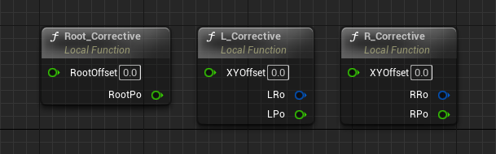
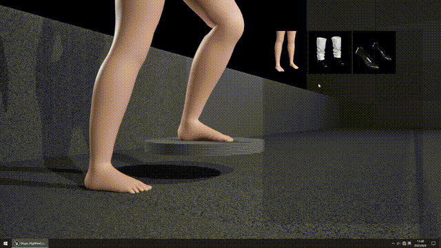

1.  1 **Feature Introduction**

&nbsp;

**Slope HighHeel Rig‌**, an extension built upon **UE5.3 Control Rig**, utilizes a compensation algorithm to achieve ground contact adaptation for high heels of varying heights on slopes ranging from **‌0° to 25°‌**. This asset is ‌available on **Fab‌** (Link will be added after approval).

* * *

&nbsp;

The project includes three built-in character states:

- Barefoot
- Flat Shoes
- High Heels

&nbsp;

&nbsp;

* * *

&nbsp;

**Current limitations: Applicable only on flat surfaces and planar slope surfaces (including stairs), with minor discrepancies occurring at varying angles.**

&nbsp;