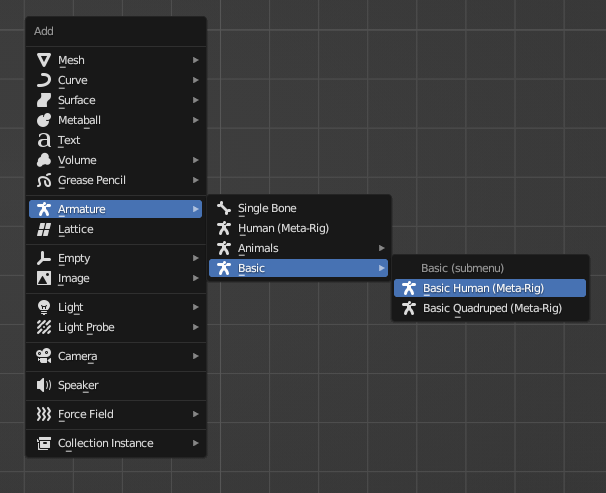
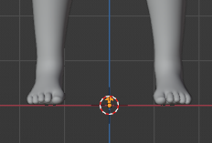
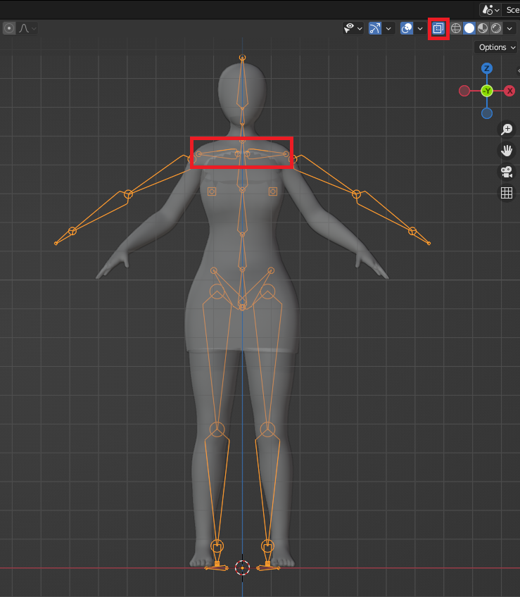
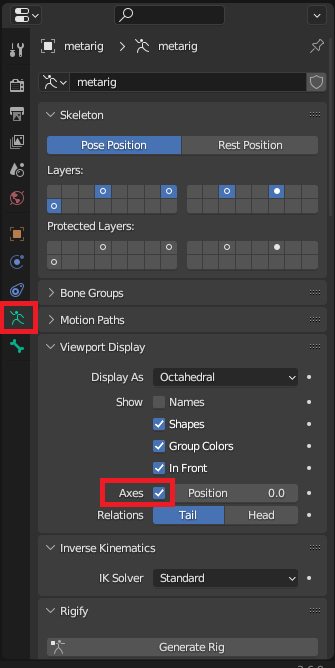
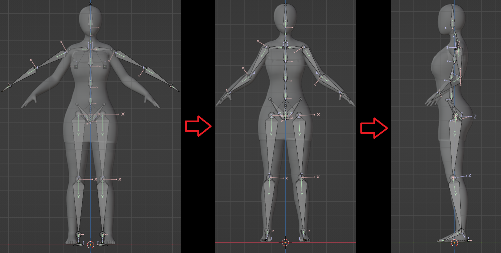
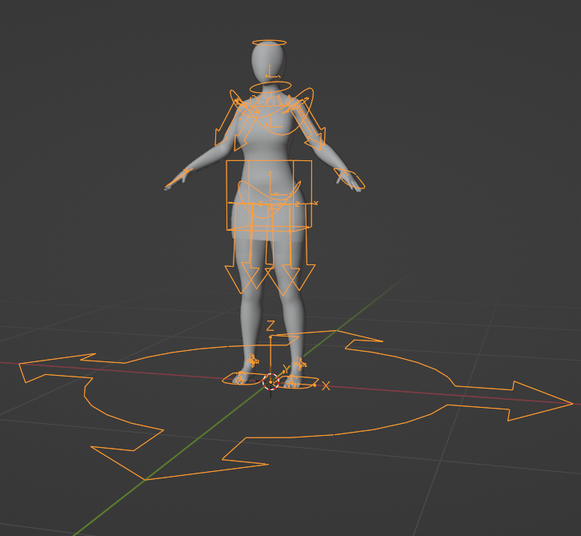

2.1 ‌**Skeletal & Controller Components** (Ref: 1.blend)

&nbsp;(All content in this chapter is for workflow practice only, **Click to download** exercise files.)

&nbsp;

‌I'm using Blender 3.6.9. You may use any DCC software you're familiar with - the principles are the same.

&nbsp;

Import **body.obj**

&nbsp;

‌Adjust world scale.

&nbsp;

* * *

&nbsp;

‌Enable the **Rigify** add-on.‌

&nbsp;

Right-click to add bones，I created the **Basic Human** metarig‌ without fingers or facial features to avoid complicating the documentation.

&nbsp;

Scale the skeleton, align it to the shoulders, and enable perspective view.

&nbsp;

‌Select the armature and enter Edit Mode.‌

&nbsp;

Display the axes.

&nbsp;

Adjust each bone to an appropriate posture.

&nbsp;

&nbsp;

‌Foot bone reference.‌

&nbsp;

&nbsp;

Switch back to ‌Object Mode‌, select the ‌**metarig**, and click ‌**Generate Rig‌**.

&nbsp;