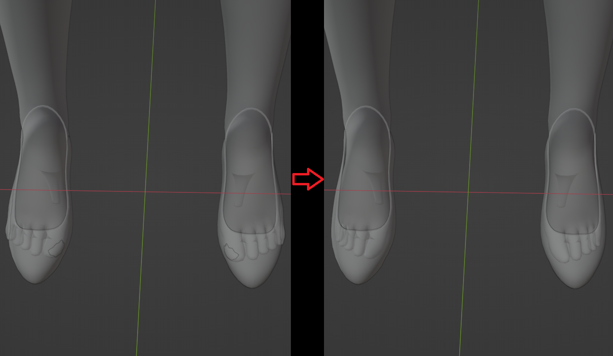

2.4 ‌**Shape Keys**（Ref: 4.blend，5.blend）

&nbsp;

‌Import the shoe model.

&nbsp;

‌Move to the appropriate position.

&nbsp;

* * *

&nbsp;

&nbsp;

‌Select the **Rig** armature, enter Pose Mode, and choose the **Foot** and **Toe** controllers.

&nbsp;

&nbsp;

‌Switch to Euler rotation.

&nbsp;

&nbsp;

‌Rotate the **Foot** controller.

During asset creation, the X-axis rotation angle of the Foot cannot exceed 33°, ‌The detection mechanism of the **Slope HighHeel Rig** only supports Foot X-axis rotation values between **0°** and **33°**, If you want to make high heels with a steeper rotation angle, use sculpt mode to adjust the foot model, making it conform to the shoe's angle.

&nbsp;

&nbsp;

‌Rotate the **Toe** controller.

&nbsp;

&nbsp;

‌Add shape keys to the character. 0 is off, 1 is on.

&nbsp;

&nbsp;

‌Enter Sculpt Mode and use a brush to push the exposed skin inward. If clipping occurs in **UE** during extreme poses, return and repeat the process.

&nbsp;

* * *

&nbsp;

‌Other shoes follow the same principle.

&nbsp;