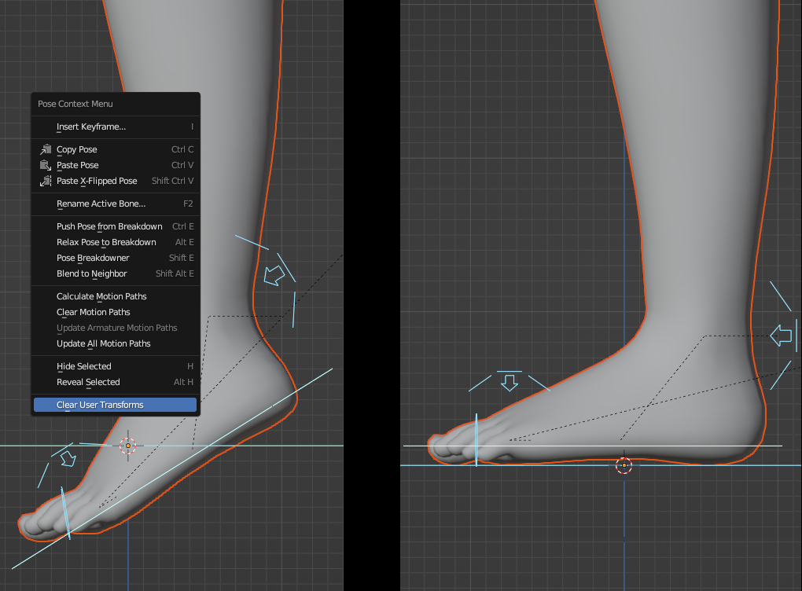
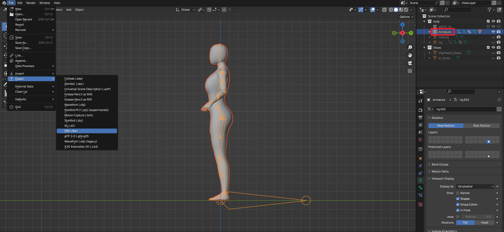
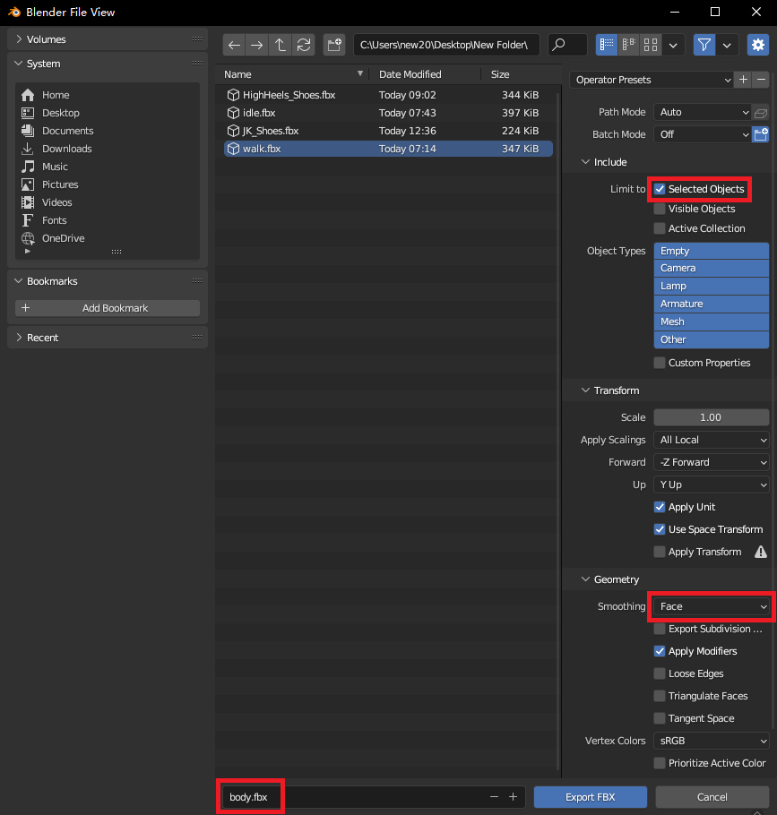

2.5 ‌**Export the character**（Ref: 6.blend）

&nbsp;

‌Switch to Pose Mode for the **rig** skeleton, press `A` to select all controllers, then right-click and Clear Pose Transforms.

&nbsp;

&nbsp;

‌Set all shape keys of the character to 0 in Object Mode.

&nbsp;

&nbsp;

Select both the character and the **Armature** skeleton, then export as a Skeletal Mesh.

&nbsp;