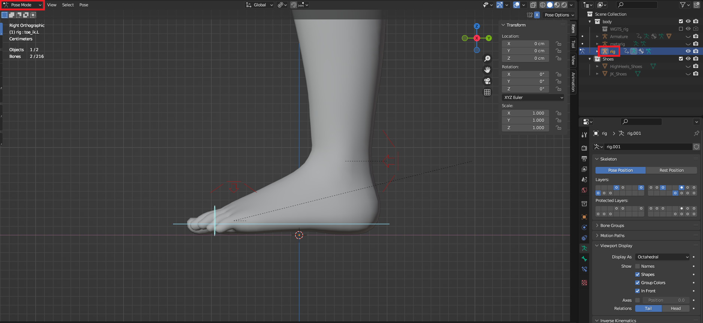
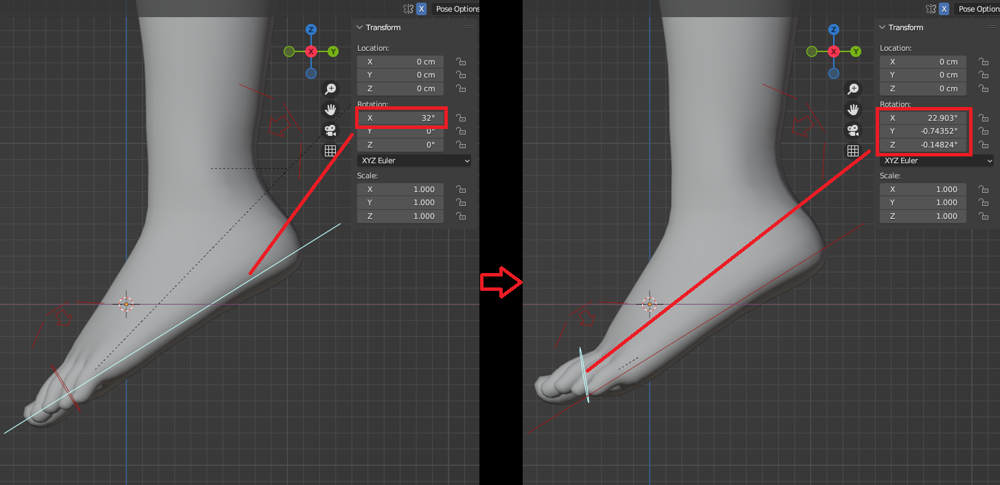
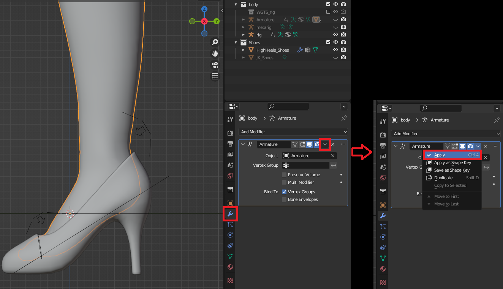
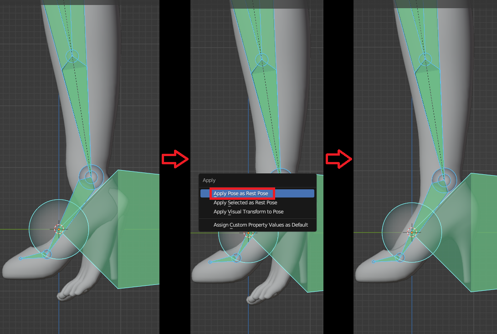
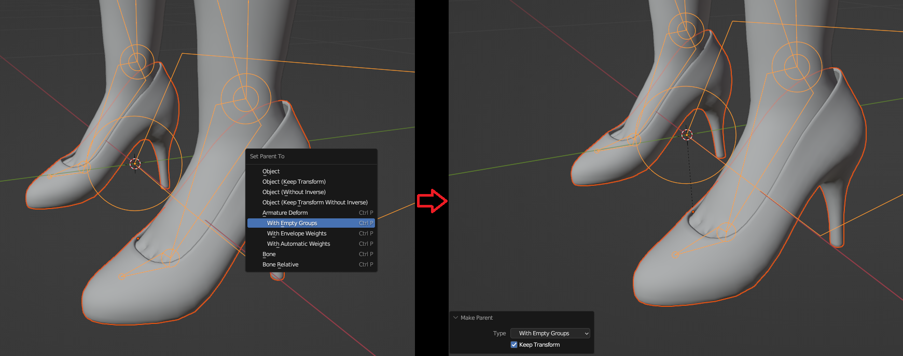
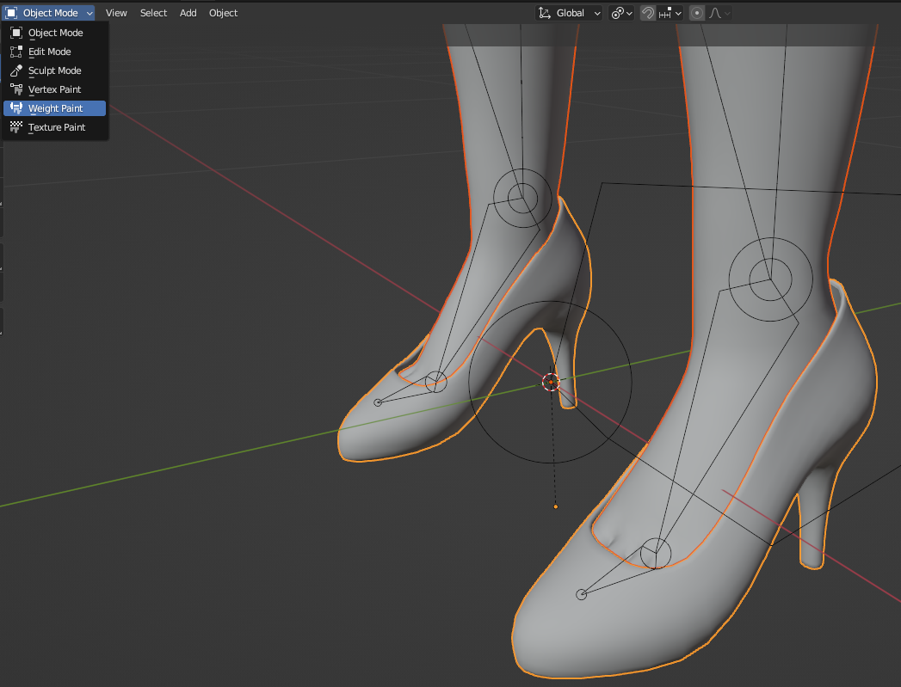
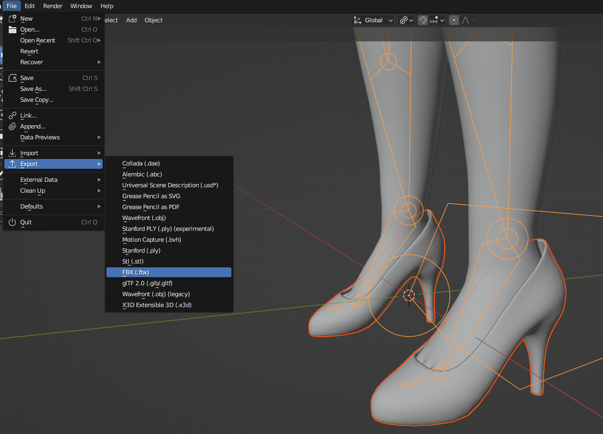
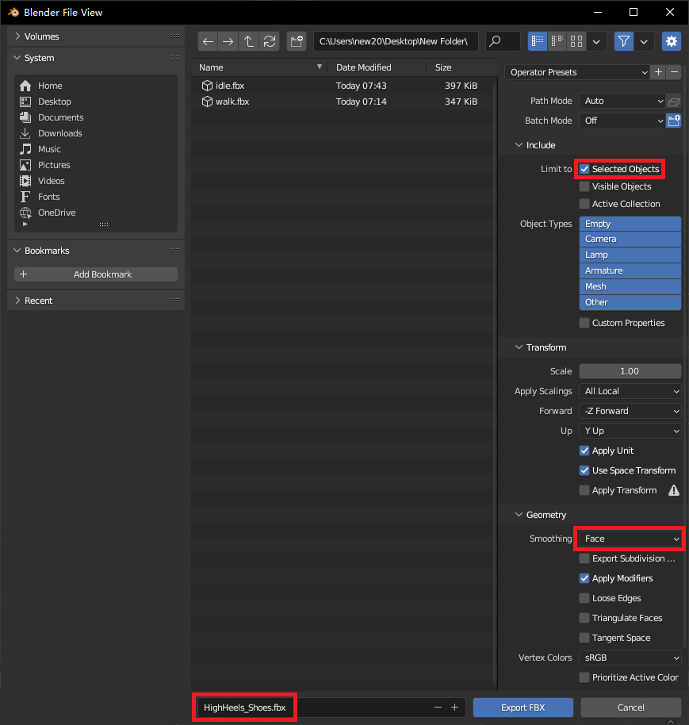

2.6 ‌**Export the shoe**（Ref: 7.blend，8.blend）

&nbsp;

‌Select the **rig** and enter Pose Mode.

&nbsp;

&nbsp;

‌Set values for **Foot.L**, **Foot.R**, **Toe.L**, and **Toe.R**.

&nbsp;

&nbsp;

‌Return to Object Mode and apply all shape keys to the character.

&nbsp;

&nbsp;

‌Return to Object Mode, select the character model, and apply the Armature modifier.

&nbsp;

&nbsp;

‌Add a new Armature Modifier.

&nbsp;

&nbsp;

‌Select the **Armature**, enter Pose Mode, press `A` to select all bones, then `Ctrl+A` to Apply Pose.

&nbsp;

* * *

&nbsp;

&nbsp;

‌Return to Object Mode, select the shoe first, then select the **Armature**, and press `Ctrl+P` Choose Without Groups.

&nbsp;

&nbsp;

‌Select the character first, then select the shoe, and enter Weight Paint Mode.

&nbsp;

&nbsp;

‌Transfer Weights.

&nbsp;

&nbsp;

‌Select the shoe and the **Armature**, then export as a skeletal mesh.

&nbsp;

* * *

&nbsp;

‌The same principle applies to other shoes.

&nbsp;